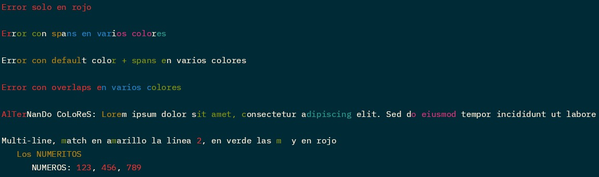

# Cute String

This crate exposes a type called `CuteString` that has methods to color the string.

The colors are defined in the `AsciiColor` enum.

[All the methods are defined in here](src/lib.rs).

You can check the docs [here](https://docs.rs/cute_strings/latest/cute_strings)

## Examples

